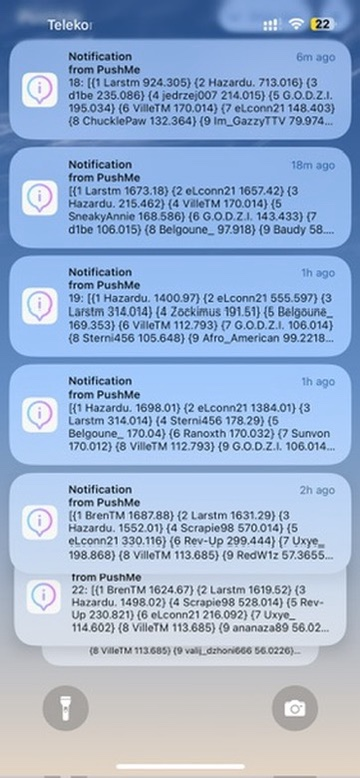
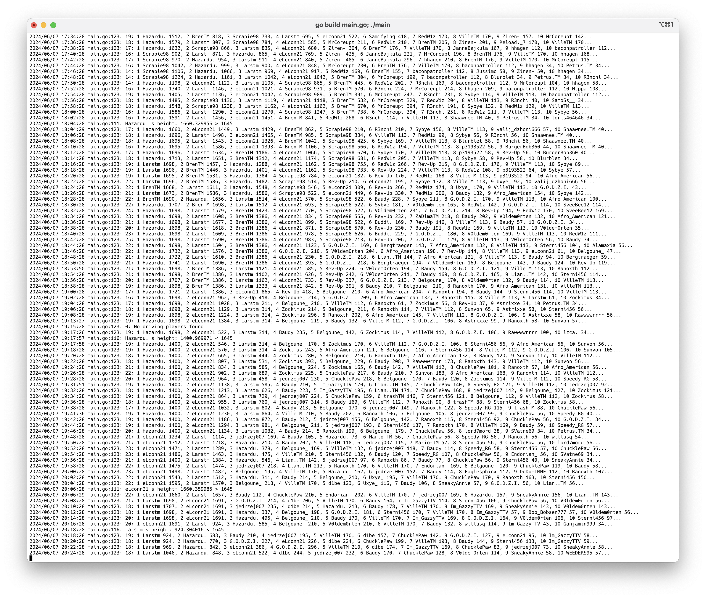

# Deep Dip 2 Notification Service

A dockerized service that sends you a notification when players come close to WR on the Deep Dip 2 competition.

You can set a distance to the current WR (`MAX_DROP_HEIGHT`), when this distance is passed, a notification can be triggered.  It is also configured to tell me when a player fell below threshold again. It then tells me the current height right on my phone’s screen ✌️





## Set environment variables

### Required

```sh
MAX_DROP_HEIGHT=107
SECRET_PLAYERS=1
```

### Optional

```sh
MYNOTIFIER_API_KEY=
PUSHME_ID=
```
